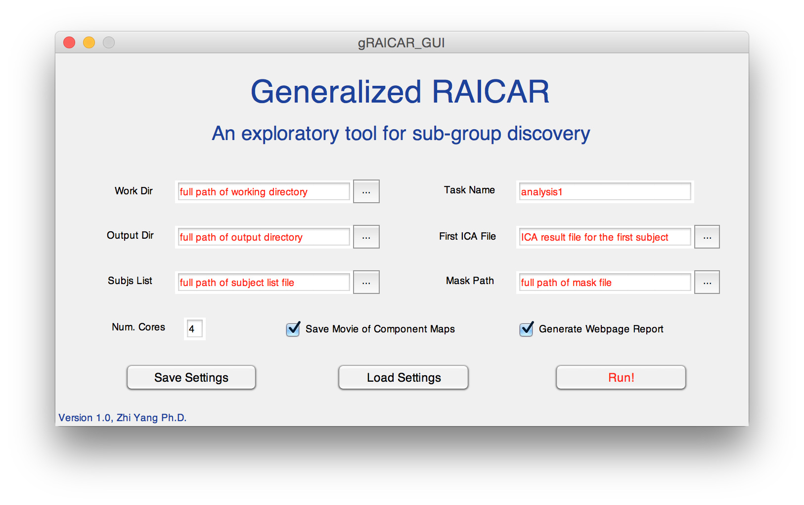
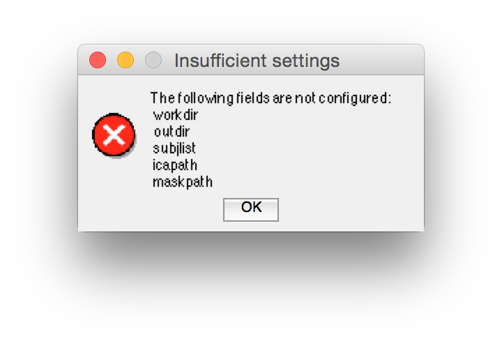
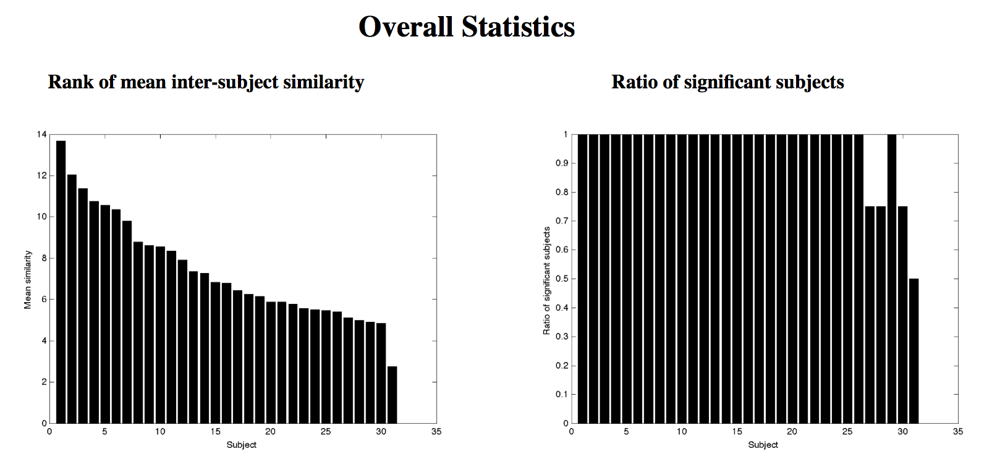
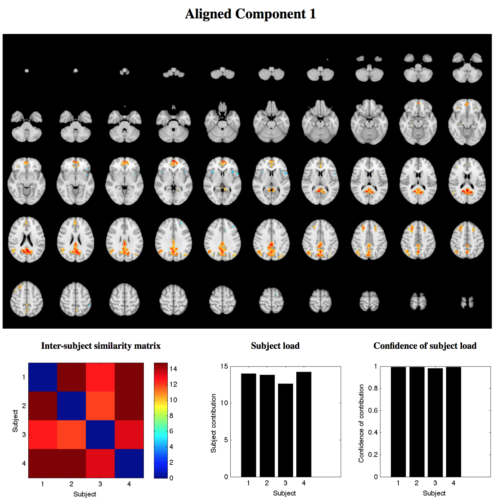
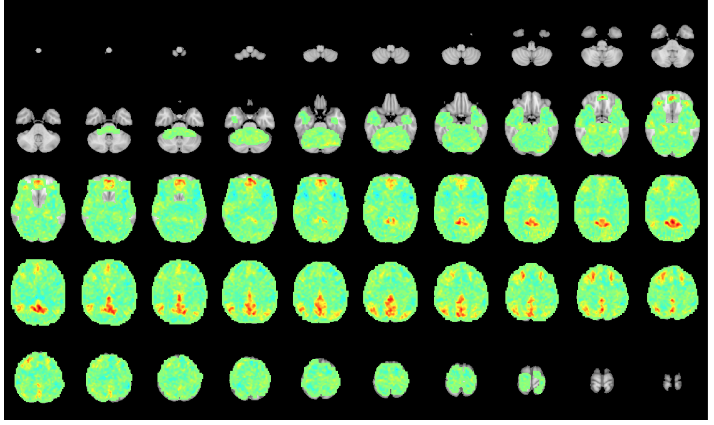

#Using gRAICAR: a tutorial
Zhi Yang Ph.D. 

Institute of Psychology, Chinese Academy of Sciences

Last revision: Jan 19, 2015

--

## Installation
Simply add the full path of the gRAICAR package to MATLAB path. An example:

```matlab
addpath(genpath('full_path_to_gRAICAR'));
```

## Prerequisite
The current version of gRAICAR assumes:

1. Independent Component Analysis (ICA) has been performed on each individual. The ICA result file is in _.nii_, _.nii.gz_, or '_.mat_' format, and is put in each individual's own directory.

2. The component maps from the ICA are spatially normalized. **The quality of the spatial normalization is very important for gRAICAR analysis. Please check the quality before gRAICAR analysis.**
3. A group-level brain mask file (in _.nii_ or _.nii.gz_ format) that is normalized to a standard space.

See [this page] (ICA_recommendation.md) for some recommendations for performing ICA, normalizing the ICA component maps, and generating group-level mask.

Here is a directory tree of the required files (also see the demo):

```bash
├── 0scripts
│   └── subjs.list
├── group
│   └── mask
│       └── grpmask.nii.gz
├── subj1
│   └── rest
│       └── ICA
│           └── melodic_autoDim
│               └── melodic_IC_mni152_3mm.nii
├── subj2
│   └── rest
│       └── ICA
│           └── melodic_autoDim
│               └── melodic_IC_mni152_3mm.nii
├── subj3
│   └── rest
│       └── ICA
│           └── melodic_autoDim
│               └── melodic_IC_mni152_3mm.nii
└── subj4
    └── rest
        └── ICA
            └── melodic_autoDim
                └── melodic_IC_mni152_3mm.nii
```

**Note:** Future release of gRAICAR aims to implement a convenient way for running ICA on individual subjects.


## Run gRAICAR (with MATLAB installed)
gRAICAR can run in both _GUI mode_ and _command-line mode_. The _command-line mode_ is suitable for performing analysis on a remote computing facility.

### GUI mode
Start gRAICAR GUI mode by typing the following in MATLAB command window:

```matlab
gRAICAR_GUI
```
This command brings up a GUI like the following:




The red texts in the six text boxes indicate the meaning of the six mandatory arguments (see below for details).

Except the '_Task Name_' argument, the other mandatory arguments can be input using either the text boxes (the red texts will be automatically removed when typing) or the file selection buttons.

The settings can be saved into a '.mat' file using the '_Save Settings_' button. The '.mat' file can be loaded in using the '_Load Settings_' button. 

When the '_Run!_' button is pressed, the input arguments will be checked. If no error is found, gRAICAR computation will start. Otherwise, an error message like the follow will show up.




**Meaning of the parameters**

_Work Dir:_ Full path of the working directory of the entire analysis.

_Output Dir:_ Full path of output directory of the analysis. All files generated by gRAICAR will be in this directory. See '_Demo_' directory for an example of the recommend directory structure.

_Subjs List:_ Full path of a subject list file, which contains the directory name for each subject. See '_Demo/0scripts/subjs.list_' for an example.

_Task Name:_ A name for the current analysis. gRAICAR will use this name as a prefix for all of its outputs.

_First ICA File:_ Full path of the spatially normalized ICA spatial map file (e.g., '_melodic\_IC\_mni152\_3mm.nii.gz_' from _MELODIC_) of the first subject.

_Mask File:_ Full path of a group-level mask (spatially normalized to standard space).

_Num. Cores:_ Number of CPU cores to use when parallel computing is possible. The default setting is the maximal available cores on the current computer.

_Save Movies of Component Maps:_ Checking this box will enable gRAICAR to write out movies of component maps across subjects, allowing users to inspect correspondence between component maps matched from different subjects. This operation will take some additional computation time and disk space.

_Generate Webpage Reports:_ Checking this box will enable gRAICAR to generate webpage reports of the gRAICAR results. 

**When running**

When gRAICAR computation is running, a message (blue text) will show up below the _Run!_ button.

Depending on the computation stages, the message will be one of the following:

- Setting up gRAICAR analysis...
- Computing similarity matrix...
- Post processing...

If an error occurs in the computation, the message will change into red. The error message can be one of the following:

- Error in gRAICAR setup
- Error in distributed computing
- Error in post processing

These error messages are helpful for debugging.

### Command line mode

gRAICAR can run in command line mode, which is suitable for running analysis on remote computation servers.

An example is provided in '_demo/0scripts/batch\_setup\_gRAICAR.m_':

```matlab
ettings.icaPrefix = 'melodic_IC_mni152_3mm.nii';
settings.icaDir    = '/rest/ICA/melodic_autoDim';
settings.outDir    = '/output';
settings.pathSbList= '/0scripts/subjs.list';
settings.maskPath  = '/group/mask/grpmask.nii.gz';
settings.ncores    = 4;
settings.workdir   = '/Users/yangz/Documents/myCode/gRAICAR/demo';
settings.outdir    = '/Users/yangz/Documents/myCode/gRAICAR/demo/output';
settings.subjlist  = '/Users/yangz/Documents/myCode/gRAICAR/demo/0scripts/subjs.list';
settings.taskname  = 'rest';
settings.icapath   = '/Users/yangz/Documents/myCode/gRAICAR/demo/subj1/rest/ICA/melodic_autoDim/melodic_IC_mni152_3mm.nii';
settings.maskpath  = '/Users/yangz/Documents/myCode/gRAICAR/demo/group/mask/grpmask.nii.gz';
settings.savemovie = 1;
settings.webreport = 1;

%%%%%%%%%%% run gRAICAR %%%%%%%%%%%%%%
gRAICAR_run (settings);
```
Users can alter the path settings as needed and run this script in MATLAB.

## gRAICAR outputs
### Short version
The webpage report is a summary of gRAICAR results. Start viewing the reports by browsing the file '_00index1.html_' in the '_webreport_' directory (see _demo/output/webreport/00index1.html_).

**Overall statistics**

Here is an example of overall statistics on the webpage report:



These plots are displayed at the top of every page of the report to provide an overview of the inter-subject consistency of the aligned components. Users can locate component of interest based on these statistics.

The rank of mean inter-subject similarity ranks the aligned components according to the mean of inter-subject similarity (inter-subject consistency). A higher value indicates that the aligned component is consistently found in different subjects.

The ratio of significant subjects plot shows the fraction of subjects that significantly contributed to the given aligned component. The significance of a subject is defined by comparing the confidence of subject load to 0.05. A >0.05 confidence means a significant contribution from that subject (alternative test, see __Interpretation of the metrics__ for more information).

**Aligned components**

Here is one aligned component from the report:



If you click on the brain map, an unthresholded map will show up like this:



### Interpretation of the metrics
**Component map**

The component maps shown in the report are thresholded by |Z|>1.5 by default, where the voxel-wise Z score here is the standardized score across the entire brain. Each component map is averaged from the ICA component maps of individual subjects (matched by gRAICAR). The weights in the averaging are different across subjects, which are centrality degree of the subjects.

The unthresholded maps are also included in the webpage reports, and can be viewed by clicking on the thresholded component maps.

**Inter-subject similarity matrix**

The inter-subject similarity matrix shows similarity across subjects. This matrix is different for different aligned components, reflecting inter-subject relationships reflected by the current brain network (current aligned component). Further analyses of this matrix may reveal information on homogeneous subgroups of individuals (for an example, see Yang Z et al., 2014 Sci Rep).


**Subject load**

The subject load index reflects centrality degree (in a weighted graph) of each subject. A higher subject load indicates a subject has a higher similarity to other subjects, and a lower subject load suggests that a subject is far from the others. Since the aligned component map is generated by weighted averaging individual component maps, subjects with higher subject load have stronger contribution to the component maps.

**Confidence of subject load**

The confidence of subject load represents the percentile of the subject load among a null distribution of maximal similarity obtained by random permutation. A higher confidence of subject load indicates a higher confidence that the subject is contributing to the current aligned component. If this index shows remarkable difference between subjects, it is suggested that there are potential subgroups.


### More details
The gRAICAR outputs are organized into the following directories/files under the specified output directory (see '_demo/output_'):

- _compMaps:_ a directory containing weighted averaged group-level component maps, e.g., _comp001.nii.gz_. If the '_Save Movies of Component Maps_' option is checked, the movies are also included in this directory, e.g., _movie\_comp001.nii.gz_. The movie files are 4-D datasets with the last dimension as subjects.
- _computeFile:_ a directory saving the partitions of the full similarity matrix between all ICA components from all subjects. These are intermediate results.
- _taskName\_aveMap.mat:_ a MATLAB data file saving the weighted averaged group-level component maps in matrix format. This file is useful for further analysis in MATLAB. The string '_taskName_' is the same as that specified before running gRAICAR.
- _taskName\_configFile.mat:_ a MATLAB data file saving the input arguments for gRAICAR.
- _taskName\_result.mat:_ a MATLAB data file containing all statistics from gRAICAR. The webpage report is generated based on these statistics.
- _taskName\_webreport:_ a directory containing the automatically generated webpage report. The index page is named as _00index1.html_.


